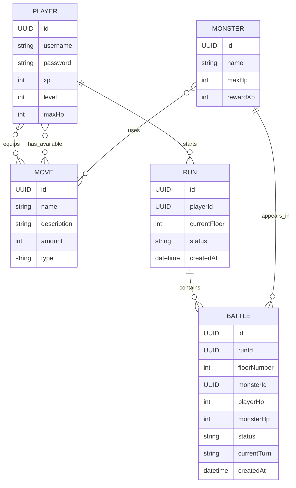

# Nordeus Challenge

A simple turn-based dungeon/battle backend built with Spring Boot, JPA, PostgreSQL, and Flyway.

## Tech stack

- Java
- Spring Boot
- Spring Data JPA
- PostgreSQL
- Flyway

## Domain model

### Move

Represents an action that can be used in battle.

- ID
- name
- description
- amount
- type (`ATTACK`, `HEAL`)

### Player

Represents a user participating in dungeon runs.

- ID
- username
- password
- xp
- level
- maxHp
- equippedMoves `Move[]`
- availableMoves `Move[]`

### Monster

Represents an enemy that appears in battles.

- ID
- name
- maxHp
- moves `Move[]`
- rewardXp

### Run

Represents one dungeon progression attempt by a player.

- ID
- playerID
- currentFloor
- status (`IN_PROGRESS`, `COMPLETED`, `FAILED`)
- createdAt

### Battle

Represents a single fight inside a run.

- ID
- runID
- floorNumber
- monsterID
- playerHP
- monsterHP
- status (`ONGOING`, `HERO_WON`, `MONSTER_WON`)
- currentTurn (`PLAYER`, `MONSTER`)
- createdAt

## Mermaid diagram

## Database overview

The project uses relational tables for core entities and join tables for move ownership and move relationships.

Main tables:
- `moves`
- `players`
- `monsters`
- `runs`
- `battles`

Join tables:
- `player_equipped_moves`
- `player_available_moves`
- `monster_moves`

## Notes

- `Move.type` is stored as an enum in the application.
- Flyway is used to version and apply database migrations.
- JPA relationships should be mapped using entity associations such as `@ManyToMany` and `@ManyToOne`.